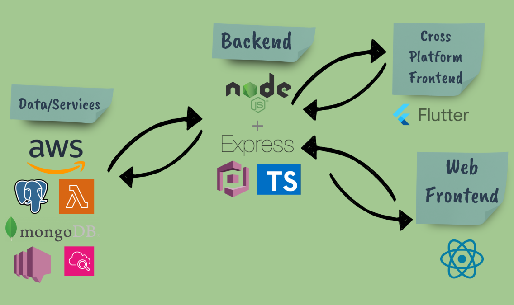

## Team Members

| Name            | Email                   |
| --------------- | ----------------------- |
| Cruz, Ron Arvin | cruzra1@myumanitoba.ca  |
| Dalool, Jay     | daloolg@myumanitoba.ca  |
| Ho, Kin Tat     | hokt@myumanitoba.ca     |
| Mehta, Hridai   | mehtah1@myumanitoba.ca  |
| Moreira, Adrian | moreiraa@myumanitoba.ca |
| Wolowich, Josh  | wolowicj@myumanitoba.ca |

## Repository

[https://github.com/Adrian-Moreira/PlanPals](https://github.com/Adrian-Moreira/PlanPals)

## Slides and Presentation

[Proposal Presentation](./ProposalPresentation.pdf)

## Summary and Vision

PlanPals is a planning platform that helps you and your friends, family, or colleagues plan trips, shop together, and manage tasks effectively and stress free. Whether you’re making travel itineraries, sharing shopping lists, or keeping track of tasks, PlanPals lets everyone collaborate in real-time, so nobody misses a beat. You can easily invite or remove people from your planning group, change the details of your shared plans, and even vote on ideas to make sure everyone is involved and their preferences are considered. Our goal with PlanPals is to make planning together enjoyable and straightforward, so you can spend less time organizing and more time enjoying your plans.

**Vision Statement:** To make planning fun and easy for groups, helping friends and family come together effortlessly when organizing trips and managing tasks.

### Core Features

#### Functional Features

1. Travel Planner
2. To-do List
3. Shopping List

#### Non-Functional Feature

Can update all cooperating users working on a shared plan in _near_ real time with edits and changes, up to at least 100 users concurrently working on different planers.

### User Stories

#### Travel Planner

1. "As a user, I want to be able to add other users to my travel plan so that I can collaborate with my friends and family"

- Acceptance Criteria:
  _Given that I am the user who created the travel plan
  When I click the settings icon and choose "add friend"
  Input the user's username and email, then click "Add"
  Then the added user should appear in the list of members
  And the other members should see the added user on the list_

2. "As a user, I want to be able to remove users from my travel plan in case I no longer want to go with them"

- Acceptance Criteria:
  _Given that I am the user who created the travel plan
  When I click the settings icon and go to "Member List" section
  Click on a member's name, then choose "remove member"
  Then the user's name should no longer appear on the list of members_

3. "As a group member, I want to make changes (e.g., add, delete, edit) contents of the group travel plan"

- Acceptance Criteria:
  _Given that I am a member of a travel plan
  When I click on the "Destination" category and input "Somewhere"
  Then "Moon" should appear on the list of destinations
  When I click on the "Destination" category again and press 'backspace' 9x
  And input "Canada", then "Canada" should appear ono the list of destinations_

4. "As a group member, I want to be able to create a poll on suggested destinations / activities to make sure members are on the same page"

- Acceptance Criteria:
  _Given that I am a member of a travel plan
  When I click on the settings icon and choose "Create a poll"
  Input options "Canada", "USA", and "Mexico"
  Then the poll with options "Canada", "USA", and "Mexico" should be visible to me
  When I click on an option and click 'vote'
  Then vote count for the option should increase by one
  And if an option is winning in votes, then it is highlighted for easy visibility_

5. "As a group admin, I want to be able to delete the travel plan in case the trip is cancelled"

- Acceptance Criteria:
  _Given that I am an admin of the travel plan
  When I click on the settings icon and choose "Delete travel plan" and click "Yes"
  Then the travel plan should no longer appear on my list of travel plans_

#### Shopping List

1. "As a user, I want to be able to add other users to my shopping list so that I can collaborate with my friends or family"

- Acceptance Criteria:
  _Given that I am the user who created the shopping list
  When I click the settings icon and choose "add friend"
  Input the user's username and email, then click "Add"
  Then the added user should appear in the list of members
  And the other members should see the added user on the list_

2. "As a user, I want to be able to remove users from my shopping list in case I no longer want to work with them"

- Acceptance Criteria:
  _Given that I am the user who created the shopping list
  When I click the settings icon and go to "Member List" section
  Click on a member's name, then choose "remove member"
  Then the user's name should no longer appear on the list of members_

3. "As a group member, I want to make changes (e.g., add, delete, edit) contents of the group shopping list"

- Acceptance Criteria:
  _Given that I am a member of a shopping list
  When I click on an empty list and type "Bread"
  Then "Bread" should be visible on the shopping list
  When I click on the list again and type "s"
  Then "Breads" should be visible on the shopping list
  When I click on the list again and press 'backspace' 6x on keyboard
  Then the list should not be empty_

4. "As a group member, I want to be able to create a poll on suggested items to buy to make sure members are on the same page"

- Acceptance Criteria:
  _Given that I am a member of a shopping list
  When I click on the settings icon and choose "Create a poll"
  Input options "Coke", "Pepsi", "Canada Dry", and "Water"
  Then the poll should appear on the shopping list so that members can vote
  When I click on an option and click 'vote'
  Then vote count for the option should increase by one
  And if an option is winning in votes, then it is highlighted for easy visibility_

5. "As a group admin, I want to be able to delete the shopping list in case I no longer need the shopping list"

- Acceptance Criteria:
  _Given that I am an admin of the shopping list
  When I click on the settings icon and choose "Delete Shopping List" and click "Yes"
  Then the shopping list should no longer appear on my list of shopping lists_

6. "As a group member, I want to be able to assign members to specific items for them to buy in case the all items cannot be acquired from one store and I want to be efficient"

- Acceptance Criteria:
  _Given that I am a member of a shopping list
  When I click on an item in the shopping list and choose "Assign member"
  Then choose the second member on the list
  Then that chosen member's name should appear by the item's name_

#### To-do List

1. "As a user, I want to be able to add other users to my to-do list so that I can collaborate with other users"

- Acceptance Criteria:
  _Given that I am the user who created the to-do list
  When I click the settings icon and choose "add friend"
  Input the user's username and email, then click "Add"
  Then the added user should appear in the list of members
  And the other members should see the added user on the list_

2. "As a user, I want to be able to remove users from my to-do list in case I no longer want to work with them"

- Acceptance Criteria:
  _Given that I am the user who created the to-do list
  When I click the settings icon and go to "Member List" section
  Click on a member's name, then choose "remove member"
  Then the user's name should no longer appear on the list of members_

3. "As a group member, I want to make changes (e.g., add, delete, edit) contents of the group to-do list"

- Acceptance Criteria:
  _Given that I am a member of a to-do list
  When I click on an empty list and type "Sleep"
  Then "Sleep" should be visible on the to-do list
  When I click on the list again and press 'backspace' 5x, then type "Clean"
  Then "Clean" should be visible on the to-do list_

4. "As a group admin, I want to be able to delete the to-do list in case I just want to chill and do nothing"

- Acceptance Criteria:
  _Given that I am an admin of the to-do list
  When I click on the settings icon and choose "Delete to-do List" and click "Yes"
  Then the to-do list should no longer appear on my list of to-do lists_

5. "As a group member, I want to be able to assign tasks to specific members so that responsibilities are clearly defined"

- Acceptance Criteria:
  _Given that I am a member of a to-do list
  When I click on a task and choose "Assign member"
  Then choose the second member on the list
  Then that chosen member's name should appear by the task_

6. "As a group member, I want to be able to check off a completed task"

- Acceptance Criteria:
  _Given that I am a member of a to-do list
  When I click on a task and choose "Completed"
  Then the completed task should appear dimmed / darkened to make it less visible_

## Initial architecture

We believe this architecture will work well as it is one that is familiar to us all. The seperation of the logic, presentation and data layer creates simple, yet very effective, seams between the three; allowing our workflow to be more felxible and efficient. While one frontend will use React and another Flutter, both of which can scale and adapt to real time updates effectively and allow us to create a clean user interface on top of it. Our backend will be powered by Node.js and Express to manage our APIs. Node can handle many simultaneous requests while express is lightweight and flexible which are both great for building a fast, responsive and scalable API layer. Additionally we have decided to use AWS Lambda paired with SNS (Simple Notification Service) for notifications and live updates. Lambda can run code without provisioning or managing servers, which means we can easily scale as more users start using the app; while SNS will handle all things notifications. Finally, we will be using PostgreSQL and MongoDB to handle our data on the backend, as it can work seemlessly with the services we have chosen.

## Work Division

For Sprint 1, we’ll start by assigning tasks to each team member based on their strengths and comfort area. Later on, as we move through the sprints, we'll rotate roles to get everyone out of their comfort zones. By mixing things up, we’ll all get the chance to learn and experience different types of technologies, and encourage us to gain new skills. At first, we’ll stick to what we know. But over time, we’ll switch things up and get out of our usual roles, so we all learn something new.
