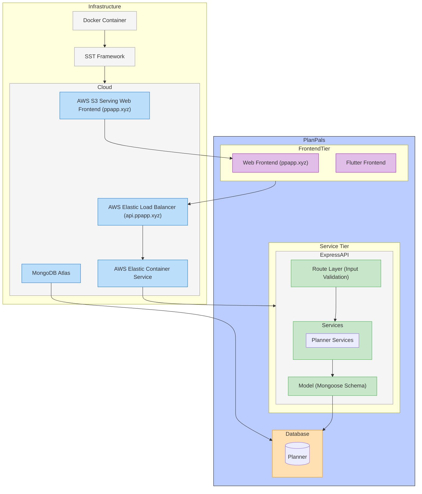

### Updated Diagram

```mermaid
flowchart TB
    subgraph "Infrastructure"
        SST["SST Framework"]
        Docker["Docker Container"]
        Docker --> SST
        SST --> Cloud
        subgraph "Cloud"
            S3["AWS S3 Serving Web Frontend (ppapp.xyz)"]
            ELB["AWS Elastic Load Balancer (api.ppapp.xyz)"]
            ECS["AWS Elastic Container Service"]
            Atlas["MongoDB Atlas"]
            ELB --> ECS
        end
    end
    S3 --> Client
    ECS --> ExpressAPI
    subgraph "PlanPals"
        subgraph "FrontendTier"
            Frontend["Flutter Frontend"]
            Client["Web Frontend (ppapp.xyz)"]
        end
        subgraph "Service Tier"
            subgraph "ExpressAPI"
                Routes["Route Layer (Input Validation)"]
                subgraph "Services"
                    subgraph "Planner Services"
                    end
                end
                Models["Model (Mongoose Schema)"]
                
                Routes --> Services
                Services --> Models
            end
        end
        subgraph "Database"
            Planners[(Planner)]
        end
    end
    Atlas --> Database
    FrontendTier --> ELB
    Models --> Database
    classDef frontendTier fill:#e1bee7,stroke:#9c27b0
    classDef apiGateway fill:#bbdefb,stroke:#1976d2
    classDef serviceTier fill:#c8e6c9,stroke:#4caf50
    classDef dataTier fill:#ffe0b2,stroke:#ff9800
    classDef infrastructure fill:#f5f5f5,stroke:#9e9e9e
    classDef containers fill:#f5f5f5,stroke:#9e9e9e
    classDef cloud fill:#f5c5b5,stroke:#1e1e1e
    classDef pp fill:#bbccff,stroke:#1e1e1e

    class Client,Frontend frontendTier
    class ELB,ECS,S3,Atlas apiGateway
    class Routes,Services,Models,PlannerService serviceTier
    class MongoDB,Database,Planner dataTier
    class SST,Docker,Cloud infrastructure
    class AWS cloud
    class ExpressAPI containers
    class PlanPals pp
```
