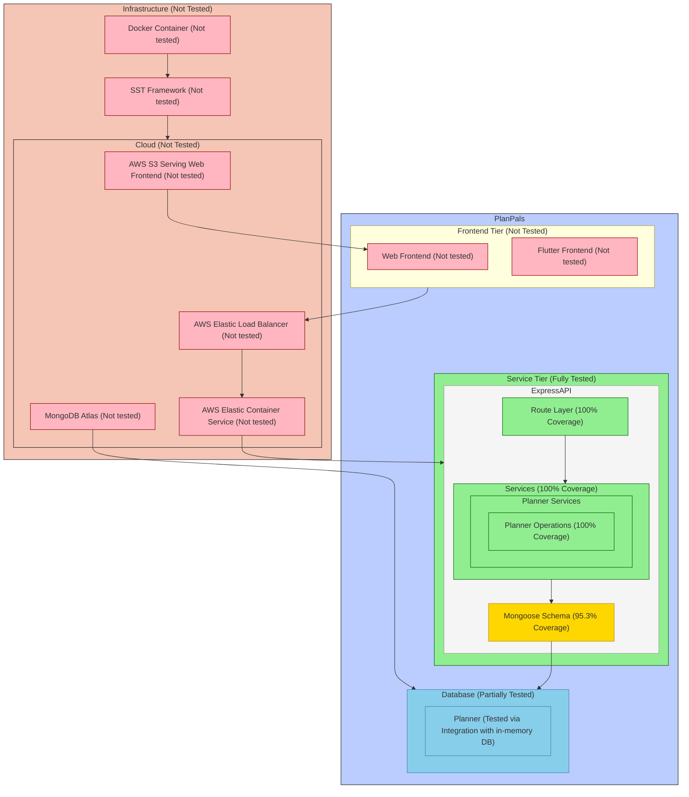

[Updated Diagram](./Diagram.md)

## Regression Testing

1. **How We Run Regression Tests:**
   - Jest + Supertest for REST API testing
   - With GitHub Actions as CI platform
   - Complete test on main pushes and pull requests
   - Changed files only during local development

2. **Test Script and Results:**
   - [GitHub Actions workflow](../../.github/workflows/main.yml) 
   ```yaml
   - name: Run PP-Server Tests
     run: |
       pushd backend/planner-service
       npm install
       npm run test -- --ci --reporters=jest-junit
   ```

   Latest Execution [Result](https://github.com/Adrian-Moreira/PlanPals/runs/32504914720)

## Testing slowdown

We have been able to keep all unit tests, integration tests in out test plan since out feature set is fairly small.

### Current Test Plans

1. **Development Testing Plan**
```bash
# During local development for the backend, we run
npm run test -- --onlyChanged
```
This runs tests only for modified files

2. **Main Plan**
```yaml
on:
  push:
  pull_request:
    branches: [main]
```
This runs a complete regression suite including all integration tests on push and pull requests.

## Not testing

### API Tier (Express + MongoDB)
[Coverage](https://github.com/Adrian-Moreira/PlanPals/releases/download/Sprint2/coverage.tar.gz)
- **Fully Tested (80%+)**:
  - Route handlers
  - Service layer
  - Model validations
  - CRUD operations
  - Error handling



## Profiler

### Slowest Endpoints:
- [Output](./profiler/Time)
  - DELETE /planner/[id]/destination/[id] ~71.04ms
    ```
    DELETE /planner/672d5a0309321a3990996ff2/destination/672d5a1309321a3990997002: 71.0425830000313ms
    ```
    - **Is this fixable?**
      - Yes, we can optimize our database delete operation to use a more efficient way instead of finding then deleting associated objects one-by-one.

- [Output](https://github.com/Adrian-Moreira/PlanPals/releases/download/Sprint2/planner-service-profile.tar.gz)
  - Frequent Database Operation
    - **Is this fixable?**
      - Yes, we can use cache for frequently accessed documents to avoid expensive database calls.

## Last Dash

1. **What issues do you foresee in the next (and final) sprint?**
   - Near real-time protocol, functionality and consistency between the 2 frontends might need more coordination.
   - Performance issue, 

## Showoff

#### Request Validation Architecture

My best contribution was designing a type-safe, reusable request validation that transform Zod schemas to validation middleware.

- Self-documenting [API contracts](../../backend/planner-service/src/controllers/transportation.ts):
    ```typescript
    const TransportationRouteSchema = {
    createTransportation: ReqAttrSchema.extend({
        params: z.object({
        plannerId: ObjectIdStringSchema,
        }),
        body: z.object({
        createdBy: ObjectIdStringSchema,
        type: z.string(),
        details: z.string().optional(),
        departureTime: z.string().datetime().or(z.date()),
        arrivalTime: z.string().datetime().or(z.date()),
        vehicleId: z.string().optional(),
        }),
    })
    }
    ```
- Validation Middleware [Factory](../../backend/planner-service/src/utils/RequestUtils.ts)
    ```typescript
    function mkParsers(schemas: Record<string, z.ZodSchema<any>>,):
        Record<string, (req: Request, res: Response, next: NextFunction) => Promise<void>>
        {
            return Object.fromEntries(Object.entries(schemas).map(([key, schema]) => [
                key, mkRequestParser(schema as z.ZodSchema<any>)
            ]))
        }
    ```

#### Infrastructure as Code

Contributed to the infrastructure setup using [SST](../../sst.config.ts) and AWS
- Declarative setup which is easy to change and expand
    ```typescript
    cluster.addService('PlanPalsService', {
        link: [atlasCluster, bucket, webFrontend, flutterFrontend],
        loadBalancer: {
            domain: {
                name: 'api.ppapp.xyz',
            },
            ports: [
                { listen: '80/http', forward: '8080/http', container: 'planner-service' },
                { listen: '443/https', forward: '8080/http', container: 'planner-service' },
            ],
        },
        containers: [
            {
                name: 'planner-service',
                image: {
                    context: './backend/planner-service',
                    dockerfile: './backend/planner-service/Dockerfile',
                },
                    environment: {
                    DATABASE_CONNECTIONSTRING: stdSrv,
                },
            },
        ],
        dev: {
            command: 'npm i && npm run start',
        },
    })
    ```
- Easy Continuous Deployment with `git push` to production branch with [SST Console](https://console.sst.dev) or `npx sst deploy --stage production` to deploy it manually.
  - Build and upload backend container to Elastic Container Registry and serve with Elastic Container Service
  - Create database at MongoDB Atlas
  - Serve static site for both frontend clients with S3
  - Load Balancer which redirects `http` and `https` requests
  - Secrets managed through SST Console or with environment variables for deploying manually.


- **"Simplicity is the ultimate sophistication"**
  - Self-documenting API contracts through reusable validation schemas, separation of concerns (Here: Validation) making the code maintainable
  - Declarative infrastructure that's easy to understand, modify and deploy
