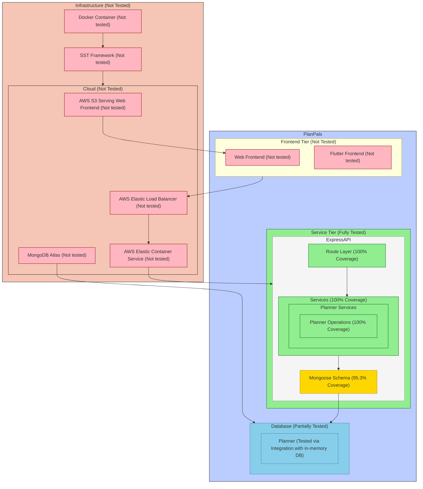

[Updated Diagram](./Diagram.md)

## Regression Testing

1. **How We Run Regression Tests:**
   - Jest + Supertest for REST API testing
   - With GitHub Actions as CI platform
   - Complete test on main pushes and pull requests
   - Changed files only during local development

2. **Test Script and Results:**
   - [GitHub Actions workflow](../../.github/workflows/main.yml) 
   ```yaml
   - name: Run PP-Server Tests
     run: |
       pushd backend/planner-service
       npm install
       npm run test -- --ci --reporters=jest-junit
   ```

   Latest Execution [Result](https://github.com/Adrian-Moreira/PlanPals/runs/32504914720)

## Testing slowdown

We have been able to keep all unit tests, integration tests in out test plan since out feature set is fairly small.

### Current Test Plans

1. **Development Testing Plan**
```bash
# During local development for the backend, we run
npm run test -- --onlyChanged
```
This runs tests only for modified files

2. **Main Plan**
```yaml
on:
  push:
  pull_request:
    branches: [main]
```
This runs a complete regression suite including all integration tests on push and pull requests.

## Not testing

### API Tier (Express + MongoDB)
- **Fully Tested (80%+)**:
  - Route handlers
  - Service layer
  - Model validations
  - CRUD operations
  - Error handling

- **Mostly Tested (20-80%)**:
  - Edge cases

- **Somewhat Tested (0-20%)**:
  - Concurrent operations
  
- **Not Tested**:
  - Race conditions
  - Long-running operations
  - Network failures

