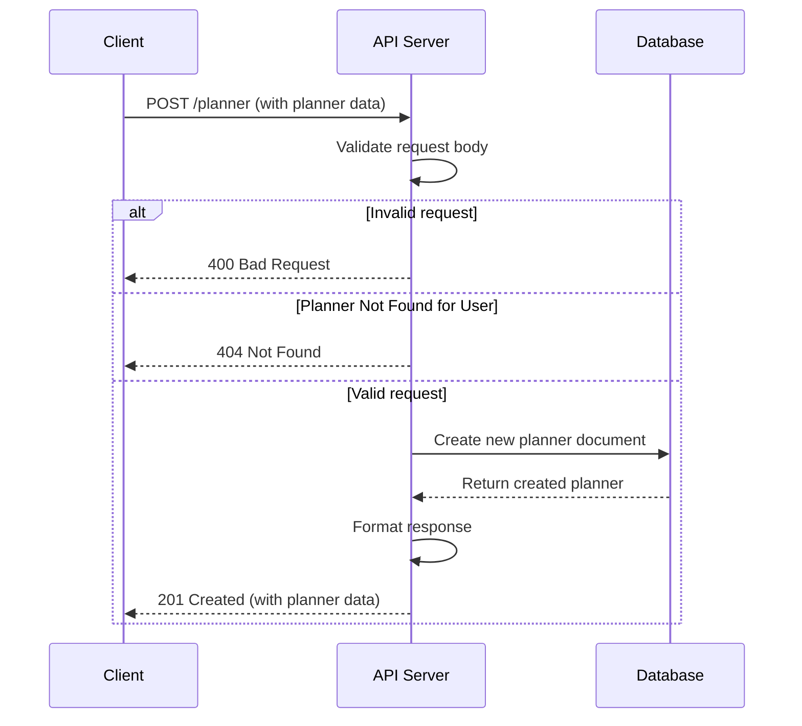

# PP Express!

PlanPals Express!

---

## Table of Contents

- [PP Express!](#pp-express)
  - [Table of Contents](#table-of-contents)
  - [API](#api)
  - [**Prerequisites**](#prerequisites)
  - [Development](#development)
    - [Setting up your Development Environment](#setting-up-your-development-environment)
    - [Running](#running)
    - [Building the Docker Image](#building-the-docker-image)
  - [License](#license)

---

## [API](./docs/README.md)

## **Prerequisites**

- To build:
  - [**Node v18.20.4**](https://nodejs.org/en/download/package-manager)
- To run:
  - Mongo
  - Or Docker

## Development

### Setting up your Development Environment

1. Clone the repository:
   ```bash
   git clone https://github.com/h-kt/PlanPals.git
   cd PlanPals/planner-service
   ```

2. Install dependencies:
   ```bash
   npm install
   ```

3. Build:
   ```bash
   npm run build
   ```

### Running

You'll need an instance of mongo running and supply the link with an environmental variable: `DATABASE_CONNECTIONSTRING`
```bash
export DATABASE_CONNECTIONSTRING="mongodb://somewhere:port" 
```
It defaults to `mongodb://localhost:27017` if nothing is supplied.

To run the service:
```bash
npm run start
```

To run tests:
```bash
npm run test
```

To run tests with coverage:
```bash
npm run test -- --coverage
```

### Building the Docker Image

To run the server using the built Docker image:

1. Running the container:
   ```bash
   docker compose -f docker-compose.yml up --build
   ```

The server will be accessible at `http://localhost:8080`.

## License

[WTFPL](./LICENSE)

## Diagrams


